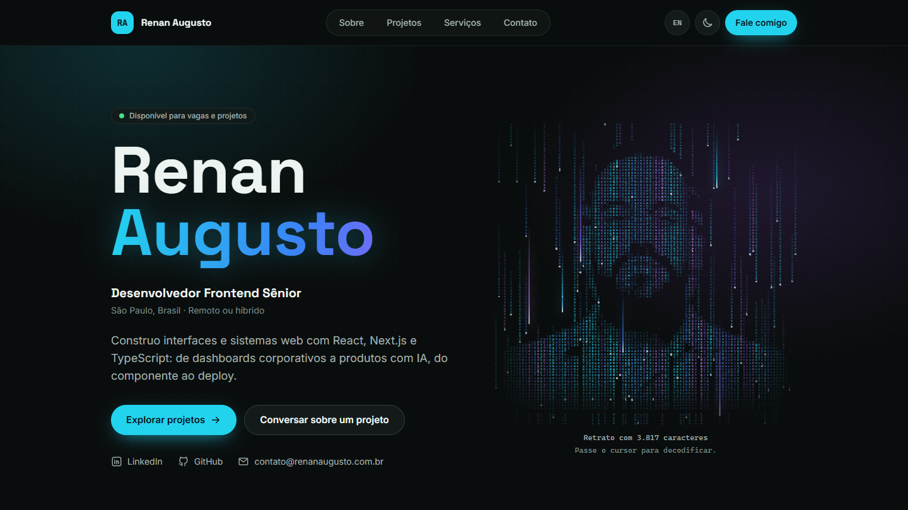

# Renan Augusto — portfólio e consultoria

**Demo:** https://www.renanaugusto.com.br

> © 2026 Renan Augusto dos Santos. **Todos os direitos reservados.** Código público apenas para avaliação de portfólio: copiar, adaptar ou reutilizar exige autorização por escrito. Veja [Licença e direitos autorais](#licença-e-direitos-autorais).



Site profissional de Renan Augusto dos Santos, desenvolvedor frontend sênior: apresentação, projetos com estudos de caso, serviços de consultoria, contratação de pacotes com pagamento online e formulário de contato, em português (`/pt-BR`) e inglês (`/en`).

## O que dá para fazer

| Página | O que tem |
| --- | --- |
| **Início** | Abertura com monograma e log de terminal, nome em destaque e retrato em chuva de caracteres: o cursor funciona como uma lente que decodifica o retrato em TypeScript. |
| **Sobre** | Trajetória, experiência e formação. |
| **Projetos** | Estudos de caso com filtros por categoria, mais os repositórios do GitHub marcados com o tópico `portfolio-site` (os com `portfolio-destaque` entram na ordem de destaque). |
| **Serviços** | Consultoria frontend e páginas por serviço, com perguntas frequentes. |
| **Contratar** | Pacotes com preço, parcelamento e prazo. O modal de pré-contratação valida os dados, aplica a máscara de telefone e leva ao **Stripe Checkout** (cartão, Pix e boleto); sem pagamento online, o pedido segue por e-mail e WhatsApp. |
| **Contato** | Formulário com envio por e-mail, limite de requisições e proteção contra robôs, além do WhatsApp. |
| **Privacidade** | Política conforme a LGPD, incluindo o uso do Google Analytics com permissão. |

Também: tema claro, escuro ou do sistema sem flash na abertura, troca de idioma mantendo a página, imagens Open Graph por idioma, dados estruturados e 404 real para URLs e slugs inexistentes.

## Stack

Next.js 16 (App Router, Cache Components) · React 19 · TypeScript estrito · Tailwind CSS 4 · Zod · Stripe (Checkout e webhooks) · Resend e Upstash Redis via API REST · Google Analytics 4 com consentimento · Vitest · Playwright · Vercel.

## Arquitetura

```text
src/
  app/[locale]/              layout raiz (lang validado), 404 por idioma, imagem OG
    (site)/                  header, footer, abertura e páginas: início, sobre, projetos, serviços, contratar, contato, privacidade
  app/api/contact/           endpoint do formulário de contato
  app/api/pre-contratacao/   pedido de pacote: valida, registra e cria a sessão do Stripe Checkout
  app/api/webhooks/stripe/   confirmação do pagamento, com assinatura verificada
  app/global-not-found.tsx   404 para URLs sem rota (inclui idiomas inválidos)
  proxy.ts                   redireciona "/" e valida slugs (404 real)
  components/                ui, layout e componentes compartilhados (tema, idioma, abertura...)
  features/                  regras por funcionalidade: home, about, projects, services, packages, contact
  content/                   conteúdo editorial tipado (pt-BR e en)
  i18n/                      idiomas e textos de interface
  lib/                       analytics com consentimento, origem da visita (UTM), vitrine do GitHub, SEO
  lib/server/                env, e-mail, leads e limitador (somente servidor)
docs/                        decisões, pagamentos, captação de pedidos, SEO, checklist editorial e publicação
tests/unit, tests/e2e        testes
```

Decisões que valem a leitura (todas em [docs/decisions.md](docs/decisions.md)):

- **Preço sempre do servidor.** O modal envia só o pacote escolhido; valor, moeda e parcelamento vêm do catálogo no servidor. Sem Stripe configurado ou em falha, o pedido é registrado e o modal oferece o WhatsApp.
- **Nunca há sucesso fictício.** Sem e-mail configurado, o contato responde 503 e a interface oferece o e-mail como alternativa; a página de confirmação só mostra pagamento aprovado depois de confirmar a sessão no Stripe.
- **404 real com Cache Components.** Com o shell pré-renderizado, o `notFound()` de um slug desconhecido respondia 200; o `proxy.ts` reescreve esses slugs para uma rota inexistente.
- **Analytics só com permissão.** Sem consentimento, o script do Google nem é carregado; parâmetros de campanha e dados do formulário nunca vão para o GA4.
- **Tema sem biblioteca.** Um script inline aplica o tema antes da pintura e `useSyncExternalStore` lê a escolha, sem divergência de hidratação.
- **Retrato desenhado em canvas.** Os caracteres ficam em um atlas e só as células que mudam são redesenhadas; o retrato pausa fora da tela e fica estático com movimento reduzido.

## Rodando localmente

Requer Node.js 20.9 ou superior (desenvolvido com 24.21) e npm. Para os testes E2E: Microsoft Edge (Windows) ou o Chromium do Playwright (`npx playwright install chromium`).

```bash
npm install
cp .env.example .env.local   # opcional em desenvolvimento
npm run dev                  # http://localhost:3000 → redireciona para /pt-BR
```

Sem variáveis de e-mail, o site funciona normalmente e o formulário informa que o envio está indisponível, oferecendo o e-mail como alternativa. Para testar o envio localmente sem mandar nada, use `EMAIL_PROVIDER=test` no `.env.local`.

| Script | O que faz |
| --- | --- |
| `npm run dev` | Servidor de desenvolvimento |
| `npm run build` / `npm run start` | Build de produção e servidor |
| `npm run lint` | ESLint (regras do Next.js + TypeScript) |
| `npm run typecheck` | Gera os tipos de rotas e roda `tsc --noEmit` |
| `npm test` | Testes unitários (Vitest): contato, pré-contratação, pagamentos, leads, analytics, filtros e parâmetros |
| `npm run build:check` | Build de produção em `.next-check`, sem interferir em um `npm run dev` aberto |
| `npm run test:e2e` | Testes E2E (Playwright) contra esse build; rode `npm run build:check` antes |
| `npm run validate` | lint + typecheck + testes unitários + build |

### Variáveis de ambiente

Todas são opcionais e estão documentadas em [.env.example](.env.example). Credenciais ficam só no servidor; nada com prefixo `NEXT_PUBLIC_` é secreto.

| Variáveis | Para quê |
| --- | --- |
| `NEXT_PUBLIC_SITE_URL`, `NEXT_PUBLIC_APP_URL` | URL pública (canonical, sitemap, Open Graph) e retorno do Stripe |
| `NEXT_PUBLIC_WHATSAPP_NUMBER`, `NEXT_PUBLIC_SCHEDULING_URL` | WhatsApp profissional e link de agendamento |
| `NEXT_PUBLIC_GA_MEASUREMENT_ID` | Google Analytics 4 (vazio = sem banner nem coleta) |
| `EMAIL_PROVIDER`, `RESEND_API_KEY`, `CONTACT_FROM_EMAIL`, `CONTACT_TO_EMAIL` | Envio do formulário de contato e dos pedidos |
| `UPSTASH_REDIS_REST_URL`, `UPSTASH_REDIS_REST_TOKEN` | Limitador de requisições global |
| `STRIPE_SECRET_KEY`, `STRIPE_WEBHOOK_SECRET`, `STRIPE_PAYMENT_METHODS`, `STRIPE_CARD_INSTALLMENTS`, `NEXT_PUBLIC_STRIPE_PUBLISHABLE_KEY` | Pagamentos (vazio = pedido registrado sem pagamento online) |
| `LEADS_WEBHOOK_URL`, `LEADS_WEBHOOK_TOKEN` | Envio de contatos e pedidos para um CRM ou n8n |
| `GITHUB_TOKEN` | Leitura dos repositórios públicos para a vitrine de projetos |

## Pagamentos e captação

- [docs/payments.md](docs/payments.md): fluxo do Stripe, configuração e teste local com `stripe listen`.
- [docs/go-live-pagamentos.md](docs/go-live-pagamentos.md): checklist para ligar os pagamentos em produção.
- [docs/lead-automation.md](docs/lead-automation.md): Analytics com consentimento, eventos do funil e webhook de pedidos para um CRM. IDs e origem da visita acompanham os e-mails; cliques no WhatsApp não contam como pedidos confirmados.

## Editando o conteúdo

Veja [docs/content-checklist.md](docs/content-checklist.md). Resumo:

- Textos de interface: `src/i18n/messages/pt-BR.json` e `en.json`.
- Perfil, experiência e formação: `src/content/<idioma>/profile.ts`.
- Projetos: `src/content/projects-base.ts` (links, imagens, tecnologias) + `src/content/<idioma>/projects.ts` (textos). Imagens em `public/images/projects/`; `scripts/capture-screenshots.mjs` captura telas das demos públicas.
- Serviços: `src/content/<idioma>/services.ts` (mesmo `slug` nos dois idiomas).
- Currículo: `public/documents/` (o botão só aparece se o arquivo existir).

## Publicação

Hospedado na Vercel. Passo a passo em [docs/deployment.md](docs/deployment.md) e SEO em [docs/seo.md](docs/seo.md).

## Autoria

Concepção, identidade visual, interface, textos e estudos de caso por **Renan Augusto dos Santos** ([renanaugusto.com.br](https://renanaugusto.com.br) · [contato@renanaugusto.com.br](mailto:contato@renanaugusto.com.br)). O retrato parte do avatar público do autor no GitHub. As capturas de projetos vêm das demonstrações publicadas de cada um.

## Licença e direitos autorais

© 2026 Renan Augusto dos Santos. **Todos os direitos reservados.**

Este não é um projeto open source. O código está público apenas para fins de portfólio e avaliação profissional. Sem autorização por escrito, não é permitido:

- copiar, modificar, redistribuir ou usar comercialmente o projeto, no todo ou em parte;
- reescrever o site em outra stack a partir deste repositório, ou reutilizar a identidade visual, o retrato animado, a interface, os textos e os estudos de caso;
- apresentar o projeto, ou parte dele, como trabalho próprio em portfólios, processos seletivos ou propostas comerciais;
- usar o conteúdo do repositório ou do site para treinar ou avaliar modelos de IA.

Os termos completos estão em [LICENSE](LICENSE). Dependências e fontes mantêm suas próprias licenças. Pedidos de autorização: [contato@renanaugusto.com.br](mailto:contato@renanaugusto.com.br).

---

## 🇺🇸 English

The professional website of **Renan Augusto dos Santos**, a senior frontend developer: introduction, project case studies, consulting services, service packages with online payment (Stripe Checkout) and a contact form, in Portuguese (`/pt-BR`) and English (`/en`). Built with Next.js 16 (App Router, Cache Components), React 19, strict TypeScript, Tailwind CSS 4, Zod, Vitest and Playwright, hosted on Vercel. Analytics only load after the visitor's consent.

© 2026 Renan Augusto dos Santos. All rights reserved. This is not open source. The source is public for portfolio evaluation only; copying, modifying, porting, redistributing, commercial use, presenting it as your own work or using it to train AI models requires written permission. See [LICENSE](LICENSE). Contact: [contato@renanaugusto.com.br](mailto:contato@renanaugusto.com.br) · [renanaugusto.com.br](https://renanaugusto.com.br).
